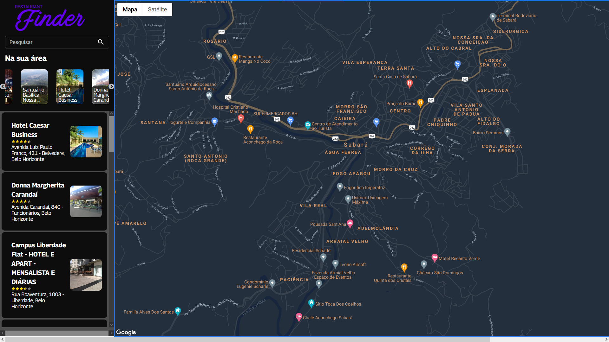
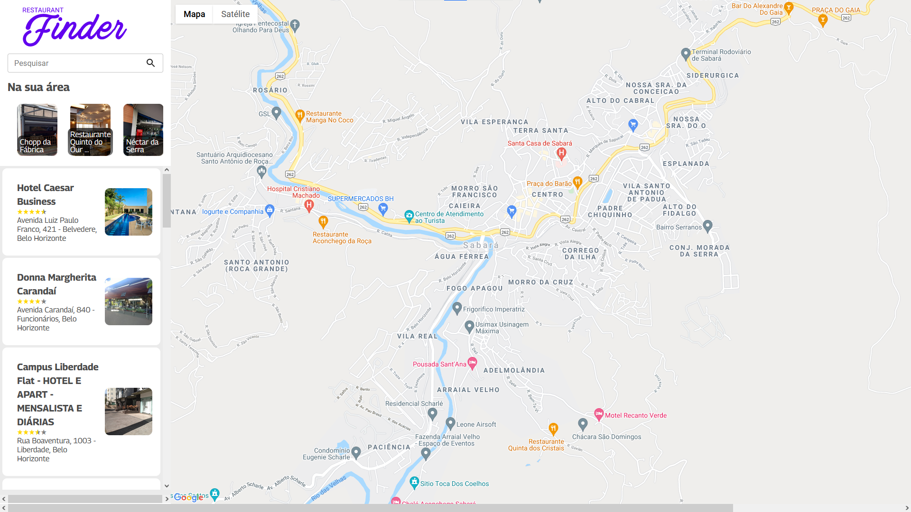

# Desafio: Criando um site para encontrar restaurantes usando Google Maps que consulta API do Google

Olá! Bem vindo ao desafio "Criando um site para encontrar restaurantes usando Google Maps que consulta API do Google" feito no Bootcamp da plataforma [Digital Innovation One](https://digitalinnovation.one/).  :wave:

Nete projeto, utilizei tecnologias de HTML, CSS, JS, React. Ative o modo escuro (ou claro) para um novo tema!
Foi testado no Chrome Versão 92.0.4515.131 e Microsoft Edge Versão 92.0.902.67 e Firefox Versão 91.0.

##### Imagens

## O Desafio

Nesse projeto vamos construir junto com o especialista um sistema web de busca de restaurantes, parecido com o serviço que o Google oferece. Vamos desenvolver esse buscador usando React.JS e API do Google, iniciando do zero à nuvem. 

